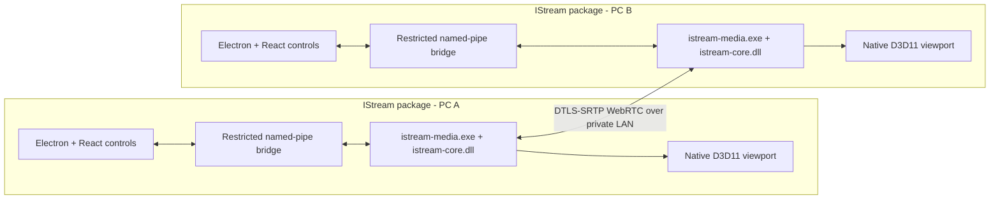

# LAN-only adaptive PC streaming: technology research and implementation plan

Status: revised research baseline, 11 August 2026

## Executive decision

Build one Windows application package that is installed on both computers and can act as sender, receiver, or both. Use a **hybrid split-process design**: Electron/React for setup, pairing, diagnostics, and styling, plus a native C++ media process for every latency-sensitive operation. For the first production path:

- Use direct peer-to-peer WebRTC/RTP over UDP.
- Gather local ICE host candidates only. Do not configure public STUN or TURN services, UPnP, NAT-PMP, cloud signaling, analytics, or update checks in an offline build.
- Secure media and control with DTLS-SRTP and authenticate the peer during local pairing.
- Discover peers with mDNS/DNS-SD, with manual IP entry as a fallback.
- On Windows, capture with Windows Graphics Capture first and DXGI Desktop Duplication second. Keep frames in D3D11 GPU memory through scaling, color conversion, encode, decode, and display where the selected hardware supports it.
- Use low-latency hardware H.264 as the guaranteed SDR codec. For the GTX 1060/Pascal minimum, use hardware HEVC Main10 for negotiated native HDR. Prefer hardware AV1 only on newer endpoints after a startup benchmark proves a benefit. Use Opus for audio.
- Prototype the native engine on GStreamer 1.28.x. Use the higher-level GStreamer WebRTC elements to prove the product, then move the production media session to webrtcbin where measurements show that lower-level control is needed.
- Use Electron 43.x, React, TypeScript, and electron-vite for the user interface, following the visual language already established by the sibling LoL Game Helper and Manga List applications. Electron must not capture, encode, decode, transport, or copy raw frames.
- Make H.264 low-latency hardware encoding the reliable Game-mode baseline. Select hardware AV1 only after a startup benchmark proves that it improves constrained-link quality without exceeding the latency budget.
- Exclude Sunshine, Moonlight, their protocol, and their code from the implementation and test baseline.
- Support remote keyboard and mouse through the native engine. The viewing endpoint sends input to the sharing endpoint; direction reversal swaps that relationship after releasing all held input state.

This choice best matches local-only operation, a reversible single application, game-oriented low delay, adaptive quality, interruption recovery, and an HD+ preferred operating point. WebRTC is not limited to browsers: its RTP, congestion feedback, retransmission, FEC, encryption, data channel, and ICE components can be used in a native application.

The two content profiles deliberately adapt differently:

- **Game:** target 1080p60, protect frame pacing, input/control, and at least 30 displayed fps. Lower bitrate first, then resolution through 900p, 720p, 540p, and optionally 480p. Do not reduce a running game stream below 30 fps. If 480p30 cannot be sustained, freeze the last complete frame, mute stale audio, and reconnect.
- **Normal:** prefer 1080p or better and text clarity. Lower bitrate and frame rate before resolution; 30 fps is sufficient for most desktop work and lower rates are acceptable for mostly static content.

"No lag or quality drops" can only be guaranteed inside a measured link and hardware envelope. Zero bandwidth, severe interference, encoder overload, or a disconnected cable makes continuous 30 fps impossible. The product therefore performs admission testing before a session, avoids quality changes on a healthy accepted path, uses hysteresis to prevent oscillation, and reports any degraded state instead of hiding it.

## Assumptions and scope

- Windows 10 x64 is the target. Support only Windows 10 22H2, build 19045, with current GPU/network drivers. Windows 10 left standard support on 14 October 2025, so release documentation must require a currently patched ESU or applicable supported LTSC installation and clearly disclose the lifecycle risk.
- Both computers are on the same trusted home/private LAN and IP subnet. Routed VLANs and enterprise discovery are explicitly out of scope. Guest Wi-Fi client isolation will prevent the design from working.
- Version 1 supports exactly one active screen stream at a time, plus audio and user-authorized remote keyboard/mouse. Keyboard/mouse support is required, although each sharing session may deny it. Either endpoint can reverse direction without restarting the application. Simultaneous two-way screen video is out of scope.
- The preferred operating point is 1920x1080 at 60 fps. Automatic fallback below HD is allowed; Game mode has a 30 fps operational floor and a default 854x480 resolution floor before freezing/reconnecting.
- Remote keyboard and mouse are required, explicit permissions and are not implied by screen viewing. Clipboard and file transfer remain separate/later permissions. Game Safety Lock forces view-only behavior for configured competitive applications.
- The oldest supported discrete GPU is NVIDIA GeForce GTX 1060 or GTX 1060 Mobile. Capability probes remain mandatory because laptop OEM routing, drivers, hybrid graphics, and endpoint decode/display support vary.
- Native HDR is preferred when capture, HEVC Main10 encode/decode, display, and color-metadata negotiation all pass. Otherwise the sender tone-maps to SDR rather than showing clipped or washed-out color.
- Protected commercial media is outside the capturable-content promise. The application will not bypass DRM, HDCP, browser CDMs, Windows protected media paths, or capture-exclusion flags.
- The application is privately installed and not commercially distributed. Optimize for a simple offline installer, but continue to include required open-source notices and avoid assuming that private use removes every codec/software license obligation.

## Product requirements

### Must have

1. One signed installer and one user-facing application for both PCs. The package may contain a separately signed native media sidecar; the same installed app exposes both sender and receiver roles.
2. Nearby-device discovery plus manual IP connection.
3. Authenticated first-time pairing and remembered device identity.
4. Monitor or window selection, optional system audio, and a local preview.
5. Direct LAN media only, with no dependency on Internet access.
6. Automatic selection of a hardware encoder and decoder.
7. Separate Game and Normal profiles, with HD+ preferred and an explicit below-HD fallback ladder.
8. In Game mode, at least 30 displayed fps while the session remains inside its admitted network/hardware envelope; otherwise freeze and reconnect rather than accumulate latency.
9. Automatic recovery from packet loss, Wi-Fi stalls, adapter changes, sleep/resume, and short disconnections.
10. A Switch direction control that turns the receiver into the sender after consent.
11. A status overlay showing codec, resolution, fps, bitrate, RTT, loss, jitter, and encode/decode/render delay.
12. Clear diagnosis for protected content, capture permission failures, unsupported hardware, firewall failures, and isolated Wi-Fi clients.
13. Capture Lock for configured applications: capture only the selected window or monitor and pause if the target disappears, preventing accidental desktop exposure.
14. Game Safety Lock for configured competitive applications such as League of Legends: view-only streaming with no process hooks, memory access, DLL injection, overlay, macro, clipboard, or synthetic remote input path.
15. Low-latency keyboard/mouse transport, injection, focus capture/release, stuck-key recovery, and safe state reset during disconnect or direction reversal.

### Security and privacy requirements

- WebRTC media must remain encrypted with DTLS-SRTP. Data channels must remain under DTLS.
- The first pairing displays a short authentication string or QR code derived from both endpoint certificate fingerprints. A paired endpoint pins that identity.
- Discovery metadata contains only a device alias, protocol version, capabilities hash, and pairing state. It does not expose usernames, screen titles, or content.
- Bind discovery, signaling, and media sockets only to user-approved private interfaces.
- Reject public, VPN, virtual-adapter, and off-subnet candidates. Do not provide an enterprise/routed-subnet override in version 1.
- The Windows Firewall rule applies only to the program, Private profile, and Local Subnet. Public-profile access stays blocked.
- Do not open router ports or use automatic port mapping.
- Incoming streaming and direction reversal require visible local consent unless the peer has been explicitly marked trusted for unattended access.
- Logs must not contain frame pixels, keystrokes, authentication secrets, full SDP credentials, or audio samples.
- The Electron renderer loads packaged local content only. Keep `contextIsolation: true`, `sandbox: true`, and `nodeIntegration: false`; apply a restrictive Content Security Policy and expose only validated, typed preload calls.
- The native media process and Electron communicate over a versioned local named-pipe protocol whose ACL is restricted to the current Windows user. Never send video frames through Electron IPC.

### Competitive-game safety requirements

Two independent controls are needed because "lock to an application" has both privacy and anti-cheat meanings:

1. **Capture Lock** binds the session to a chosen window/process identity. If that source closes, is replaced, or becomes unavailable, pause the stream instead of falling back to the full desktop.
2. **Game Safety Lock** is activated when a configured executable is detected. It forces view-only mode, disables clipboard/file transfer and all remote-input or automation paths, hides any Electron/native overlay from the game display, and exposes status only in the tray, control window, or a second monitor. Re-enabling control requires local confirmation after the protected process exits.

The detector may use normal Windows process enumeration and executable signature/path matching. It must not open the game process for memory reads, inject a DLL, hook DirectX/Vulkan/OpenGL, install a kernel driver, analyze pixels for gameplay automation, simulate input, or attempt an anti-cheat allow-list/bypass. Capture must use supported Windows capture APIs only.

Riot states that external memory-reading tools are not allowed under Vanguard, and describes process attachment, memory use, DLL hooks, and simulated input as cheating techniques. Riot also says there is no Vanguard allow list. Consequently, the safest IStream policy is deliberately narrower than what may technically work. It reduces the risk surface but **cannot guarantee that Riot or another publisher will never flag or ban the software**. Before public release, test signed builds on the relevant public test environment where available, document the behavior, and request publisher/developer support when uncertain. If capture is blocked, stop and report it; do not bypass the block.

## Measurable performance targets

These are engineering acceptance targets, not codec guarantees:

| Condition | Initial target |
|---|---:|
| Game preferred stream | 1920x1080, 60 fps |
| Game admitted floor | at least 30 displayed fps; 854x480 minimum before freeze/reconnect |
| Normal preferred stream | 1920x1080, 60 fps; preserve at least 1280x720 where possible |
| Wired glass-to-glass p95 | at most 70 ms in Game mode |
| Wi-Fi glass-to-glass p95 | at most 100 ms on a healthy 5/6 GHz link in Game mode |
| Displayed-frame pacing | p99 inter-frame deviation at most 8 ms at 60 fps, 12 ms at 30 fps |
| Healthy-session tier changes | zero after admission during a 30-minute test |
| Nominal packet loss | below 0.5% |
| Recoverable random packet loss test | 3%, without manual reconnect |
| Short outage | freeze immediately; resume within 2 seconds after a 1-second outage |
| Adapter/IP change | resume within 5 seconds when local signaling can be re-established |
| Direction switch | first decoded frame within 2 seconds after remote acceptance |
| CPU use | hardware path should not require a full CPU core for video encode |
| Public traffic | zero media, signaling, discovery, telemetry, or DNS packets to public addresses |

Starting bitrate envelopes for testing:

| Format | H.264 | Hardware AV1/HEVC |
|---|---:|---:|
| 720p30 | 3-6 Mbit/s | 2-4 Mbit/s |
| 540p30 | 1.5-3.5 Mbit/s | 1-2.5 Mbit/s |
| 480p30 | 1-3 Mbit/s | 0.8-2 Mbit/s |
| 1080p30 | 5-10 Mbit/s | 3-7 Mbit/s |
| 1080p60 | 10-20 Mbit/s | 6-12 Mbit/s |

Desktop text, fine UI lines, camera video, and games have very different coding complexity. These ranges are initial test envelopes. Game mode should initially allocate media no more than 50-60% of stable measured goodput, leaving headroom for motion bursts, RTP/RTCP, encryption, audio, and repair packets. A 1080p60 session should not start merely because a link once reached its nominal link rate.

"At least 30 fps without lag" becomes the following testable promise: after the preflight admits a tier, at least 99% of one-second windows in a 30-minute healthy-link game test contain 30 or more displayed frames, no tier changes occur, render queues stay at one frame or less, and no unexplained freeze exceeds 100 ms. Outages and deliberately impaired links are recovery tests, not part of that healthy-link guarantee.

## Technology comparison

### 1. Direct WebRTC/RTP: recommended

Advantages:

- Designed for interactive real-time media rather than buffered playback.
- RTP/RTCP provides timing, receiver reports, NACK, keyframe requests, retransmission, FEC negotiation, and transport-wide congestion feedback.
- Congestion control can change encoder bitrate and delivery behavior as network capacity changes.
- DTLS-SRTP encryption is mandatory in the WebRTC architecture.
- Data channels carry pairing/session commands and the required keyboard/mouse protocol without a separate network stack.
- ICE can use Ethernet and Wi-Fi host candidates and can restart after path changes.
- Symmetric peer connection semantics fit a single application that reverses direction.
- Native endpoints can still interoperate with a browser client later if desired.

Disadvantages:

- WebRTC does not standardize application signaling, discovery, pairing UX, or the encoder adaptation policy; the product must define them.
- Full libwebrtc is a large, fast-moving dependency with a difficult native build. GStreamer or libdatachannel reduces this burden.
- Codec, SVC, RTX, FEC, and hardware-acceleration behavior varies between implementations.
- Tuning a low-delay desktop stream still requires real network and GPU testing.

Verdict: use this for the main product.

### 2. Sunshine/Moonlight: explicitly excluded

The user has repeatedly experienced problems with Sunshine/Moonlight, so it is not an implementation option, dependency, protocol choice, fallback, or acceptance baseline. This plan does not assume that rebuilding its configuration or UI would solve those problems. IStream instead uses standard WebRTC/RTP behavior, its own symmetric endpoint model, its own network admission and recovery controller, and vendor-neutral latency tests.

This exclusion removes a shortcut: capture compatibility, frame pacing, hardware-codec qualification, input security, and interruption recovery must all be proven directly on the supported IStream hardware matrix.

### 3. Microsoft RDP and other remote-desktop protocols

Advantages:

- RDP is a mature, secure Windows remote-session protocol with graphics remoting, input, audio, continuous network detection, and reliable/lossy UDP multitransport modes.
- It is already present in supported Windows editions and is well optimized for desktop text and UI content.
- It may be the correct buy-versus-build answer when the real requirement is remote administration rather than sharing the currently visible console.

Disadvantages:

- Windows Home cannot act as an incoming RDP host, and enabling the host requires administrative configuration.
- A normal RDP connection creates or takes over a Windows session; it is not identical to capturing and sharing the user's current physical-console pixels.
- Product UI, direction reversal, capture-source selection, codec control, and the exact 720p/video-quality policy are not under this application's control.
- Embedding or reimplementing the full protocol and Windows host behavior is much more complex than invoking the existing Windows feature.

VNC-style remote framebuffer protocols are simpler and cross-platform but are generally less efficient for high-motion HD video unless extended with a video codec and adaptive transport, at which point the same custom-stack problems return.

Verdict: offer RDP as an external alternative for remote administration, but do not base this screen-streaming product on it.

### 4. Secure Reliable Transport (SRT)

Advantages:

- UDP-based, payload agnostic, encrypted, and mature in broadcast contribution.
- Selective retransmission, configurable latency, late-packet dropping, optional FEC, and connection bonding handle lossy paths well.
- Simple point-to-point caller/listener/rendezvous modes.

Disadvantages:

- Repair is built around a receiver latency buffer; greater resilience costs more delay.
- It does not supply codec negotiation, capture, rendering, interactive data channels, or a desktop-oriented adaptation policy.
- It is not natively supported by browsers.
- Bitrate/resolution adaptation still has to be built above SRT.

Verdict: a good optional reliable-broadcast mode if 150-500 ms latency is acceptable, but not the primary interactive mode.

### 5. RIST

Advantages:

- Professional interoperable RTP transport with NACK-based recovery.
- Main and advanced profiles add encryption, tunneling, bonding, and FEC options.
- Good fit for contribution feeds over managed or impaired networks.

Disadvantages:

- Like SRT, it solves transport recovery, not the endpoint product, codec adaptation, UI, discovery, or role reversal.
- Smaller desktop application ecosystem and no direct browser path.
- Its broadcast emphasis does not justify the integration cost for a two-PC interactive LAN.

Verdict: not selected unless professional broadcast interoperability becomes a requirement.

### 6. NDI / NDI HX

Advantages:

- Excellent LAN discovery and a large production-video ecosystem.
- High-bandwidth NDI favors quality and very low delay; NDI HX lowers bandwidth for Wi-Fi.
- Commercial SDKs reduce some integration work.

Disadvantages:

- Proprietary technology, SDK terms, certification, and redistribution constraints must be accepted.
- High-bandwidth NDI can be excessive on Wi-Fi. HX behavior is less transparent and hardware dependent.
- It is oriented to media-production sources rather than adaptive remote-desktop behavior and secure pairing.

Verdict: useful only if interoperability with existing NDI equipment is a product goal.

### 7. Custom RTP/RTSP

Advantages:

- Simple to prototype and gives complete packet-level control.
- Broad codec and tool support.

Disadvantages:

- The team would have to rebuild secure keying, congestion control, NACK/RTX/FEC policy, session negotiation, path migration, data channels, and browser interoperability.
- A superficially simple prototype tends to become a proprietary WebRTC subset.

Verdict: do not build a custom stack.

### 8. QUIC datagrams, WebTransport, and Media over QUIC

Advantages:

- QUIC offers encryption, streams, datagrams, connection migration, priorities, and modern congestion control.
- Media over QUIC is explicitly working on low-latency publish/subscribe, partial reliability, and relays.
- WebTransport provides a browser-oriented QUIC surface.

Disadvantages:

- As of August 2026, Media over QUIC Transport is still an active Internet-Draft, not a stable RFC.
- Codec payload, feedback, recovery, adaptation, and endpoint interoperability are less mature than WebRTC/RTP.
- Reliable QUIC streams can cause head-of-line delay if media dependencies are mapped poorly.
- It solves future scalable distribution better than today's two-peer LAN requirement.

Verdict: keep a transport abstraction and track it, but do not make the first product depend on it.

### 9. TCP, WebSocket video, RTMP, HLS, or DASH

These are not suitable for the primary path. Reliable ordered delivery stalls newer video behind an old lost packet, and segmented delivery adds avoidable latency. WebSocket remains appropriate for local signaling only.

## Codec decision

### GTX 1060/Pascal baseline

NVIDIA's current Video Codec SDK documentation states that Pascal supports hardware H.264, HEVC, and HEVC Main10 encoding, while hardware AV1 encoding starts with newer GPU generations. Therefore:

- **SDR/default:** NVENC H.264 8-bit 4:2:0, low-latency preset. This is the simplest and most interoperable Game-mode path.
- **Native HDR:** NVENC HEVC Main10 with P010 10-bit surfaces. H.264 High10 is not available on Pascal and must not be assumed.
- **AV1:** unavailable in hardware on GTX 1060/1060 Mobile. Do not use software AV1 for the latency-sensitive path. Enable AV1 only when both newer endpoints pass runtime hardware capability and latency tests.

Query `NvEncGetEncodeCaps` and actual GStreamer/NVENC element negotiation at runtime. A GPU family label alone is not sufficient, particularly on Optimus/hybrid laptops.

### H.264/AVC

Use as the guaranteed fallback.

Advantages:

- Mandatory baseline WebRTC interoperability and near-universal hardware encode/decode.
- Usually the simplest route to low encode and decode delay.
- Mature drivers and RTP packetization.

Disadvantages:

- Requires more bandwidth than newer codecs for comparable quality.
- Patent licensing must be reviewed for distributed products.
- Common 4:2:0 paths can blur colored desktop text at aggressive bitrates.

### AV1

Prefer when both endpoints report hardware encode and hardware decode, especially on Wi-Fi or when high motion must fit a smaller bitrate.

Advantages:

- Better compression efficiency than H.264.
- Standard RTP payload format and rich temporal/spatial scalability.
- Published by the Alliance for Open Media with a royalty-free design goal.
- Current NVIDIA, AMD, and Intel GPU families provide hardware paths on supported models.

Disadvantages:

- Older computers may decode but cannot encode AV1 in hardware.
- Software real-time AV1 can consume too much CPU and add delay.
- Driver and SVC support is less uniform than H.264.
- Product patent due diligence is still required; a design goal is not legal advice.

### HEVC/H.265

Use as the preferred native-HDR codec when both endpoints report hardware Main10 support. It may also be offered for constrained SDR links, but H.264 remains the default until measurements prove that Pascal HEVC quality is worth any latency/compatibility cost.

Advantages:

- Strong compression and mature hardware on many PCs.
- Main10 is useful for HDR.

Disadvantages:

- Multiple patent pools and software/device licensing considerations remain relevant even for private redistribution, although there is no commercial product rollout in scope.
- WebRTC/browser interoperability is not as universal as H.264.
- It provides less strategic benefit if hardware AV1 already works.

### VP9

Keep as a browser-interop or software fallback experiment, not a primary native Windows codec. It supports WebRTC SVC well, but cross-vendor hardware encoding is less dependable than the H.264 path and less attractive than AV1 on new hardware.

### Audio

Use Opus at 48 kHz, normally 96-160 kbit/s stereo for system audio. Prioritize audio packets over video enhancement data. Enable Opus in-band FEC only when the negotiated receiver and observed loss justify it. Capture the Windows system mix with WASAPI loopback.

### Encoder configuration

- Select a low-latency hardware preset.
- Disable B-frames and large look-ahead windows on the interactive path.
- Use a shallow VBV/rate-control buffer.
- Allow bitrate changes without destroying the encoder when the driver supports it.
- Send an IDR/keyframe every 1-2 seconds and immediately after join, decoder recovery, or path restart.
- Start with 4:2:0 for compatibility. Add a tested 4:4:4 Text mode only when both hardware paths explicitly support it.
- Treat HDR as a separate negotiated end-to-end capability and prefer it when it produces a measurable visual benefit without breaking latency or stability.

### Native HDR policy

Expose `HDR: Auto / Native / SDR`:

- **Auto (default):** choose Native only when the captured source is HDR, both endpoints support HEVC Main10 encode/decode, the receiving Windows display is in HDR mode, and a short capability test passes. Otherwise GPU-tone-map to SDR.
- **Native:** keep the capture path in `DXGI_FORMAT_R16G16B16A16_FLOAT`, GPU-convert to P010 without an 8-bit intermediate, encode HEVC Main10, transmit BT.2020/PQ color description and HDR10 mastering/MaxCLL metadata, decode to a 10-bit surface, and present through the HDR-capable swap chain.
- **SDR:** tone-map once on the sender to an SDR 8-bit H.264 path. This avoids wasting HEVC/Main10 bandwidth and receiver work when the destination cannot show HDR.

Microsoft explicitly recommends `R16G16B16A16_FLOAT` throughout Windows Graphics Capture for HDR to avoid over-clipping/washed-out results. Validate every conversion with HDR color-bar, dark-scene, highlight, and SDR-on-HDR tests. If HDR metadata or display state changes mid-session, perform a clean renegotiation/keyframe or temporarily tone-map; never reinterpret HDR pixels as SDR.

## Capture and the browser black-screen problem

### Supported capture path

1. Windows Graphics Capture is the default for a selected monitor or window.
2. DXGI Desktop Duplication is the fallback for full-display capture and driver-specific failures.
3. Frames stay in D3D11 memory and are scaled/color-converted on the GPU.
4. Avoid GDI BitBlt as a production fallback; it misses modern GPU surfaces and is slower.
5. Recreate frame pools after resize, DPI change, display mode change, device loss, or graphics-adapter reset.
6. When Windows HDR is enabled, capture with a floating-point format and tone-map deliberately.

### Diagnose black frames by cause

| Cause | Expected handling |
|---|---|
| DRM, HDCP, PlayReady/Widevine protected surface | Content may be black by design. Show Protected content cannot be captured. Do not bypass it. |
| Application uses WDA_EXCLUDEFROMCAPTURE or another capture-protection API | Respect the exclusion and report it when detectable. |
| Browser or app permission denied | Reopen the supported Windows capture picker and explain the required consent. |
| Minimized, cloaked, destroyed, or resized window | Pause, reacquire/recreate the capture target, or offer monitor capture. |
| Legacy capture path misses GPU overlay | Retry with Windows Graphics Capture or whole-monitor DXGI capture. Do not make disabling hardware acceleration the normal solution. |
| HDR/pixel-format mismatch | Recreate the pipeline with FP16 capture and SDR tone mapping, or negotiate a 10-bit path. |
| Hybrid-GPU/cross-adapter mismatch | Recreate resources on the capture adapter or perform an explicit cross-adapter copy; report the extra cost. |
| Driver reset/device removed | Tear down only the graphics pipeline, keep the session alive, then request a keyframe. |

For ordinary, unprotected Chrome, Edge, or Firefox content, Windows Graphics Capture should be the normal route. If the product itself owns the web application, browser tabCapture or getDisplayMedia is another supported option, but it requires user activation/permission and does not override protected content. Turning off browser hardware acceleration is acceptable as a diagnostic experiment only because it harms the performance goal.

The same protected-content boundary applies to audio: Windows WASAPI loopback does not expose protected digital streams through an untrusted capture path.

## Recommended architecture

The recommended hybrid boundary is process-level, not merely a native Node addon. A media crash should not corrupt the UI, and a renderer compromise must not gain direct access to capture or control. Conversely, the Electron event loop must never sit on the media critical path.

    Endpoint A                                           Endpoint B
    -----------                                          -----------
    mDNS/DNS-SD discovery  <---- private LAN only ---->  mDNS/DNS-SD discovery
    pairing + local TLS    <---- identity/control ---->  pairing + local TLS

    Windows Graphics Capture                             D3D11 renderer
             |                                                 ^
    D3D11 scale/color                                         decode
             |                                                 ^
    HW H.264/AV1/HEVC  -> RTP/SRTP/UDP + Opus -> jitter/repair
             ^                                                 |
             +------ RTCP TWCC/RR/NACK/PLI feedback ------------+

    Reliable data channel: direction switch, source metadata,
    consent, pause/resume, keyboard/mouse events, and telemetry.

The entire diagram is symmetric. On direction reversal, B activates its capture and encoder, while A activates its decoder/render path.

### Major components

- Electron shell: frameless React/TypeScript UI, tray behavior, notifications, consent, source selection, settings, and diagnostics.
- Restricted preload bridge: small, typed commands/events only; it validates IPC sender and payloads and exposes no raw Electron or Node APIs.
- Native `istream-media.exe` process: a thin Win32 host that owns the message loop, process lifetime, D3D11 viewport, and loads `istream-core.dll`.
- Native `istream-core.dll`: owns discovery, pairing, capture, audio, codecs, WebRTC, adaptation, input translation, and game-safety monitoring behind a narrow versioned C ABI. It is never loaded into an Electron process.
- Native D3D11 viewport: receives decoded GPU surfaces directly. The preferred MVP uses a separate borderless native window coordinated with Electron. A child-HWND embedding spike may improve visual integration, but it must pass DPI, focus, resize, z-order, fullscreen, and frame-pacing tests.
- Discovery service: mDNS/DNS-SD service advertisement and browsing, plus manual address fallback.
- Pairing service: device key generation, QR/SAS verification, certificate pinning, revocation, and trusted-device policy.
- Session controller: signaling, capability exchange, direction state, ICE restart, and reconnection.
- Capture broker: monitor/window enumeration, WGC/DXGI selection, resize and device-loss handling.
- Audio broker: WASAPI loopback and optional microphone capture.
- Codec broker: detects GPU adapters and verified encode/decode capabilities, then ranks codecs and zero-copy paths.
- Media graph: GStreamer capture/transform/encode/WebRTC/decode/render elements inside the native process.
- Adaptation controller: consumes RTCP/TWCC and local encoder/decoder metrics and controls bitrate, fps, resolution, FEC, and frame dropping.
- Telemetry view: in-memory metrics and opt-in local diagnostic export.

### Current implementation stack

- GStreamer stable 1.28.x. At the research date, 1.28.5 is current.
- GStreamer d3d11screencapturesrc with the Windows Graphics Capture mode, d3d11 scaling/conversion/rendering, hardware encoder/decoder elements, wasapi2src loopback, Opus, and WebRTC.
- webrtcsink/webrtcsrc for the first end-to-end spike because they already expose GCC-style congestion control, bitrate limits, framerate/resolution mitigation, FEC, retransmission, a control data channel, and renegotiation.
- webrtcbin for the production session if the higher-level elements prevent the requested profile ladders, codec policy, one-peer optimization, or interruption state machine.
- Electron 43.x (43.3.0 was the current stable release at the research date), React, TypeScript, electron-vite, and electron-builder/NSIS for the shell. Pin to a currently supported stable Electron line and keep Chromium security updates moving.
- C++20 x64 for `istream-media.exe` and `istream-core.dll`. Keep GStreamer behind a narrow media interface so that libdatachannel, libwebrtc, or a future QUIC path can be tested without rewriting the UI or host executable.
- A versioned named-pipe IPC schema for commands and low-rate statistics. Apply a current-user ACL, authenticate the child process, bound message sizes/rates, and keep all pixel/audio buffers out of IPC.

### UI/native boundary decision

| Option | Bundling | Isolation and latency | Maintenance | Verdict |
|---|---|---|---|---|
| Load media DLL through a Node-API `.node` addon in Electron main | One installer, but the addon/DLL must live outside ASAR | No process isolation; a native fault or GStreamer/driver deadlock takes down pairing, tray, and UI. Media callbacks can also stall Electron's main loop if bridged incorrectly. | Native modules must follow Electron's build/load rules; strict Node-API reduces but does not remove dependency-DLL and packaging work. | Reject for the media engine. |
| Load addon from a Node worker thread | Same files as above | Separates CPU scheduling, not address space. Memory corruption or fatal native errors still kill the containing Electron process. | The addon must be Node-API/context-aware and clean up correctly for each worker environment. | Reject; a thread is not a reliability boundary. |
| Load addon in Electron `utilityProcess` | One installer and real process isolation; Electron supplies the child executable | Viable control/service boundary with MessagePorts, but the process still embeds Node/V8 and loads an Electron-compatible native addon. Creating and owning the production Win32/D3D viewport from this environment adds an unnecessary integration surface. | Requires `.node`/DLL ASAR handling and remains coupled to Electron's Node runtime and lifecycle. | Keep only as a prototype fallback. |
| Thin `istream-media.exe` loading `istream-core.dll` | One NSIS installer through `extraResources`; users still install and launch one IStream app | Full crash isolation, no raw-frame IPC, native Win32/D3D/GStreamer lifetime, smaller runtime than an extra Node/V8 process, and clear restart diagnostics. | No Electron ABI dependency. The C ABI lets tests or a future CLI use the same core DLL. | **Selected.** |

The sidecar does not add meaningful steady-state latency because media frames, packets, audio, and input remain completely inside the native process. Named-pipe traffic is limited to setup commands, consent, state changes, and approximately 2-4 Hz UI statistics. Electron supervises the sidecar but does not schedule its media work.

A tiny Node-API addon remains acceptable later for genuinely UI-local OS conveniences that Electron cannot provide, but it must not link GStreamer, own D3D resources, access capture, perform WebRTC, inject input, or load `istream-core.dll`.

Do not start with an Electron `<video>` receiver. Chromium capture/render is convenient but adds another compositor and makes native zero-copy behavior, latency attribution, and protected-game interaction less predictable. It remains a measured fallback only if it meets the same frame-pacing and latency tests. Likewise, do not copy sibling Chromium flags such as `ignore-gpu-blocklist`, experimental shared-texture rendering, or blanket zero-copy switches into production. `force_high_performance_gpu` may be tested, but only enable it when GPU diagnostics and power/compatibility measurements justify it.

### Private installation strategy

Provide two x64 artifacts built from the same version:

1. **Recommended NSIS installer:** one guided install that places the Electron shell, signed `istream-media.exe`, signed `istream-core.dll`, a minimal pinned GStreamer MSVC runtime/plugin set, license notices, and the required Visual C++ runtime. It requests elevation only for installation/firewall work, creates a program-scoped Windows Firewall rule limited to the Private profile and Local Subnet, and never runs the application itself as administrator.
2. **Portable diagnostic ZIP:** useful for development and rollback, but it requires a manual firewall prompt/rule and should not be the normal user path.

Load NVENC/NVDEC from the installed NVIDIA driver; do not bundle the NVIDIA driver or require the full Video Codec SDK on the destination PCs. Cache no dependencies from the Internet at first run. The package, pairing, discovery, and streaming must work with the Internet physically disconnected.

Electron Builder should copy the complete native tree with `extraResources` to a stable path such as `resources/native/win-x64/`; executable/DLL files must not be placed inside `app.asar`. The Electron main process locates the host through `process.resourcesPath`, launches that exact absolute path hidden and non-detached, and performs a protocol/build-version handshake before exposing controls.

Do not self-extract native binaries into a temporary folder at every launch and do not use executable packers such as UPX. A stable installed path is easier for Windows Firewall, signatures, antivirus reputation, crash dumps, and publisher/anti-cheat inspection. Harden DLL loading in the sidecar with an application-private directory and safe Windows DLL search APIs rather than changing the machine-wide `PATH` or searching the current directory.

Place the sidecar in a Windows Job Object owned by the Electron main process so logout/crash normally terminates it. On an orderly UI update or shutdown, request a media stop, release all injected input, close the session, and then exit. If the sidecar crashes, Electron reports the native exit code/dump and may restart it only when no active control permission or protected-game transition could make an automatic restart unsafe.

Since this is private/non-commercial deployment, skip public auto-update infrastructure, store signing, analytics, and enterprise deployment tooling. Still pin exact dependency versions, produce hashes for the installer, retain an uninstall path, and bundle all third-party notices.

## LAN-only connection design

### Discovery

- Advertise a service such as _istream._tcp.local through DNS-SD.
- Include protocol major version, capability hash, pairing state, and a random instance ID in TXT metadata.
- Resolve to a fixed local signaling port.
- mDNS is link-local and fits the same-LAN scope. Manual IP plus pairing code remains mandatory for hosts whose local firewall, access point, or mDNS service blocks discovery.

### Signaling and media

- Local TLS signaling on a fixed documented TCP port simplifies firewall rules and reconnection.
- Allocate a narrow configurable UDP port range for ICE/RTP rather than unrestricted ephemeral ports.
- Gather host candidates from approved Ethernet and Wi-Fi interfaces. Do not query public STUN/TURN.
- Rank wired candidates ahead of Wi-Fi, then rank by measured RTT/loss rather than interface name alone.
- Configure a safe RTP payload size near 1200 bytes to avoid IP fragmentation across mixed links.
- Use a single bundled WebRTC transport for audio, video, and data where practical.

### Pairing

1. A discovers B or enters B's local address.
2. Both exchange ephemeral challenge material and long-term device certificate fingerprints over the local signaling channel.
3. The requester displays a short numeric authentication string (or later, a QR code) and waits.
4. The requested device must enter that string to confirm both peer presence and user consent; the requester's initiation is its consent.
5. Each device stores the peer fingerprint and friendly alias in OS-protected storage.
6. Future sessions authenticate the pinned device before offering capture or input permissions.

Discovery is not authentication. A hostile device on the same Wi-Fi must not be able to impersonate a remembered peer.

### Direction reversal

- Negotiate symmetric codec capabilities at session start.
- Keep one video transceiver per direction, initially with only the selected direction active. This avoids a fresh application-level connection.
- The receiver sends SwitchDirectionRequest over the reliable ordered data channel.
- The current sender prompts locally, disables its input injector, releases every held key/button, and replies.
- Renegotiate transceiver directions, start the new capture/encoder, send an immediate keyframe, and stop the old encoder after the new path is confirmed.
- Reverse the input route only after the new sender has explicitly granted control; never allow both injectors to be active.
- Keep the same authenticated session and metrics display.

### Keyboard and mouse translation

Keep input handling inside `istream-media.exe`, not Electron:

- The native viewer viewport captures keyboard HID usages/scancodes and mouse buttons, wheel, absolute coordinates, and high-resolution relative deltas through normal Windows input APIs.
- Translate physical keyboard events to scan-code-based `SendInput` events on the sharing PC so common layouts and games behave predictably. Maintain an explicit layout mapping layer for special/media keys and expose per-device remapping rather than hard-coding one keyboard locale.
- Use relative mouse mode for games and absolute desktop coordinates for normal use. Transform absolute positions through the captured monitor/window rectangle, DPI scale, crop, and letterboxing.
- Send key/button transitions over a small reliable ordered data channel. Send high-rate mouse motion over an unordered channel with no retransmission or a very small retransmit limit so old motion can never block new motion.
- Add monotonically increasing sequence numbers and periodic complete input-state snapshots. On focus loss, panic-key activation, permission removal, session loss, direction reversal, or process crash, synthesize releases for every held key and mouse button immediately.
- Reserve a local-only escape chord that is never forwarded. The remote user cannot suppress the sharing PC's local keyboard/mouse or consent UI.
- Respect Windows User Interface Privilege Isolation: do not elevate the whole application merely to control an elevated window. If elevated-control support is later required, isolate it in a separately consented and signed helper.
- Measure event-to-injection latency and input queue depth separately from video latency. Coalesce only mouse motion; never coalesce key/button transitions.

`SendInput` is the easy-install, user-mode MVP. Some games may ignore or restrict synthetic input. Do not add a virtual HID/kernel driver by default: it complicates signing/install/uninstall and materially increases anti-cheat risk. If a future optional driver is investigated, it requires a separate threat model, publisher compatibility review, explicit installation, and an automatic block under Game Safety Lock.

## Adaptation policy

### Inputs sampled every 250-500 ms

- Estimated available send bitrate and actual goodput.
- RTT, loss, packet reordering, NACK/RTX success, late packets, and jitter-buffer delay.
- Encoder QP, target/actual bitrate, encode time, skipped frames, and GPU queue depth.
- Decoder time, render queue time, dropped frames, and display refresh mismatch.
- Capture dirty-region ratio or content-change score.
- Current interface, Wi-Fi signal information when available, and path changes.

### Control policy

1. Run a 5-second UDP preflight and a short hardware encode/decode benchmark before selecting the initial codec, resolution, and fps. Game mode should reserve 40-50% stable-goodput headroom; Normal mode may use more when content is static.
2. Downshift only after persistent congestion over multiple measurement windows. Upshift after at least 10 seconds of stable headroom. Add minimum tier dwell times so Wi-Fi variation cannot cause visible oscillation.
3. Never solve congestion by queuing seconds of video. The capture-to-render pipeline is latest-frame-oriented, with no more than one queued render frame in Game mode; drop obsolete non-reference frames.
4. Change encoder bitrate first. A temporary QP increase is preferable to an immediate tier change, but enforce a quality ceiling so the picture does not become unreadable.
5. **Game mode:** preserve 60 fps while stepping 1080p -> 900p -> 720p; when necessary step 60 -> 45 -> 30 fps, then preserve 30 fps while stepping 720p -> 540p -> 480p. Never run below 30 fps. If 480p30 cannot be sustained, freeze/reconnect.
6. **Normal mode:** preserve 1080p/720p clarity, lower 60 -> 45 -> 30 -> 20/15 fps according to content motion, then lower resolution. Static frames may be refreshed at a low cadence without changing their displayed resolution.
7. **Auto mode:** select Game policy for a user-selected game or high sustained content-change score, and Normal policy for normal applications. Never silently switch into a policy that violates an explicit user selection.
8. Keep audio and control traffic ahead of video enhancement data. Under Game Safety Lock, control means session management only; remote input is disabled.
9. Restore conservatively: target quality/bitrate, then resolution, then frame rate as allowed by the selected profile. Request a clean keyframe at a resolution transition.
10. Offer **Adaptive** and **Quality Lock** behavior. Adaptive uses the ladder above. Quality Lock holds the chosen resolution/fps and freezes/reconnects if it becomes unsustainable rather than silently degrading.

The resolution ladder is a policy, not a promise that every encoder supports live reconfiguration. Prefer encoders that can change bitrate in place; prepare adjacent resolution encoders or perform a tightly bounded reconfiguration/keyframe transition when the driver cannot resize cleanly.

### Loss repair

- Use RTCP NACK and RTP retransmission on the low-RTT LAN when the retransmitted packet can still arrive before its playout deadline.
- Request a keyframe with PLI after irrecoverable reference loss, decoder restart, or reconnect.
- Apply FEC only to the observed loss level and important layers. Extra FEC during congestion can worsen the congestion.
- Prefer RTX over always-on FEC when LAN RTT fits the latency budget, matching WebRTC's FEC guidance.
- Keep a shallow adaptive jitter buffer, approximately one to a few frames, with a user-selectable Low latency versus Smooth mode.

### Interruption state machine

    Idle -> Discovering -> Pairing -> Negotiating -> Streaming
                                                  -> Degraded
                                                  -> Reconnecting
                                                  -> Streaming or Failed

- A sub-100 ms burst is handled by jitter buffering and repair.
- A capacity drop lasting up to several seconds triggers the active profile's bitrate/fps/resolution policy and obsolete-frame dropping.
- A lost path freezes the last good frame, mutes stale audio, keeps local UI responsive, and enters Reconnecting.
- Retry quickly at first, then back off to 0.25, 0.5, 1, 2, and 5 seconds while the app is foregrounded.
- On a new IP or interface, rediscover the pinned peer, exchange fresh host candidates, perform ICE restart, and request an immediate keyframe.
- On sleep/resume or D3D device loss, rebuild only the affected capture/codec/render resources.
- After a configurable timeout, preserve the paired device but end the media session with a useful reason.

Freezing is explicit: retain the last completely decoded frame, place a prominent `Connection interrupted - reconnecting` state outside the game surface where Game Safety Lock requires it, stop presenting stale audio, and reset timestamps on recovery so the receiver never drains an old queue.

## Ethernet and Wi-Fi requirements

### LAN to LAN

- Preferred topology.
- Gigabit Ethernet is not required for HD, but it provides ample headroom and predictable jitter.
- A 100 Mbit/s wired link can carry the target stream if it is otherwise healthy.

### LAN to Wi-Fi

- Prefer a wired sender or receiver connected to the access point and a 5 GHz or 6 GHz wireless peer.
- Avoid 2.4 GHz for the preferred 1080p60 mode.
- The application should run a short UDP capacity/RTT/loss probe before choosing the initial format.

### Wi-Fi to Wi-Fi

- Both packet legs consume wireless airtime through the access point, so nominal PHY rate is a poor proxy for usable stream capacity.
- Require 5 GHz, 6 GHz, or a proven clean link for 1080p. Treat 2.4 GHz as degraded/unsupported for the performance promise.
- Avoid guest SSIDs, client isolation, weak mesh backhaul, power-saving stalls, and Bluetooth coexistence where measurements show interference.
- Wi-Fi 6/6E is a practical baseline; Wi-Fi 7 multi-link features may improve resilience when the AP, both clients, and drivers all support them, but the application must still adapt because those features cannot be assumed.
- If both PCs have Ethernet available, prefer it automatically but let the user override the choice.

Recommended launch gates:

- Start Game 1080p60 only when a 5-second probe shows at least 30 Mbit/s stable UDP goodput, p95 RTT below 20 ms, low jitter/loss, and the measured hardware encode/decode path stays inside its frame budget.
- Start Game 720p60 only when at least 17 Mbit/s stable goodput remains; start 720p30 at 11 Mbit/s; admit 540p30 at 7 Mbit/s and 480p30 at approximately 5 Mbit/s. These deliberately conservative gates keep repair and motion-burst headroom.
- If no 30 fps Game tier passes admission, do not start with a misleading "lag-free" status. Offer Normal mode, a network diagnostic, or a user-visible best-effort override.
- These are conservative initial thresholds to validate and tune on the target hardware matrix.

DSCP can be offered as an advanced managed-network feature, but it is only a marking. It improves behavior only if the Windows policy, access point, switch, and queues honor it; the application must not rely on DSCP for correctness.

## User interface

Use the sibling projects as the local design reference, not as a security/runtime template. The preferred stack is Electron + React + TypeScript + electron-vite with a frameless title bar, compact controls, and restrained animation. Reuse these blue/black tokens from LoL Game Helper:

The complete settings hierarchy, GTX 1060 encoder values, versioned presets, validation rules, and requested/effective/current UI are specified in [IStream configuration model and stable baselines](configuration-specification.md).

| Token | Value |
|---|---|
| Background 0 / 1 | `#0a0c10` / `#0e1117` |
| Panel / raised panel | `rgba(20,23,30,.92)` / `rgba(28,32,41,.92)` |
| Accent / dim accent | `#4ab3e6` / `#2f7fb0` |
| Primary / muted text | `#e7ecf3` / `#8a93a3` |
| Accent glow | `rgba(74,179,230,.55)`, used sparingly |

Use Segoe UI/Inter, approximately 10 px corners, a near-black radial gradient, and uppercase micro-labels where they help scanning. Reserve clear non-blue colors for healthy, degraded, reconnecting, protected, and Game Safety Lock states. The fullscreen media viewport is native and visually minimal; never draw a game-analysis overlay.

### Home

- Nearby devices with paired/unpaired badges, current route (Ethernet/Wi-Fi), and link-quality estimate.
- Share this PC, View remote PC, and Enter IP actions.
- A visible Local network only badge.
- A one-click preflight that reports the highest admitted Game and Normal tiers before connection.

### Share setup

- Monitor/window picker with live thumbnails.
- Game, Normal, Auto, and Custom profiles, plus Adaptive or Quality Lock behavior.
- System audio, microphone, HDR Auto/Native/SDR, local preview, and keyboard/mouse permission toggles.
- Estimated initial resolution/fps/bitrate before start.
- Capture Lock selector and an editable Game Safety Lock application list. Ship a conservative League of Legends preset, show exactly which capabilities it disables, and never claim ban-proof operation.

### Streaming

- Fullscreen and windowed native D3D11 display coordinated with the Electron control window.
- Compact overlay: connection quality, codec, resolution, fps, bitrate, RTT, loss, and total latency.
- Switch direction, Pause, Change source, Audio, Keyboard/mouse permission, Diagnostics, and End.
- A non-modal Reconnecting indicator that never hides the reason.
- Under Game Safety Lock, move controls/status out of the captured game display and disable overlays, remote input, clipboard, and automation visibly.

### Diagnostics

- Capture path, GPU adapter, encoder/decoder, zero-copy status, link route, firewall status, last ICE failure, loss/repair counts, and latency breakdown.
- A Test capture action that detects repeated identical/black frames and walks through supported causes.
- Protected content is reported as a policy boundary, not as a generic codec failure.
- Export a sanitized local report.
- Show Electron/Chromium GPU feature status separately from the native adapter/codec path so Chromium issues are not confused with media-engine issues.

## Implementation plan

### Milestone 0: capability and black-frame spikes

- Freeze Windows 10 22H2 x64/build 19045 and GPU-driver support matrices, including the supported/ESU disclosure.
- Define a narrow versioned C ABI for `istream-core.dll` and a separate versioned named-pipe protocol for Electron. Prove that a deliberate native crash terminates only the probe/sidecar, not Electron.
- Implement the encoder qualification probe needed by `game-sdr-stable-v1`, `game-hdr-stable-v1`, and `desktop-clear-stable-v1`; record effective element properties and zero-copy/latency results.
- Build a small GStreamer 1.28.5 probe for WGC/DXGI capture to a D3D11 renderer.
- Test Chrome, Edge, Firefox, office apps, video playback, games, HDR, minimized windows, hybrid GPUs, and known DRM content.
- Confirm that ordinary unprotected browser content works and protected content fails explicitly.
- Enumerate NVENC, AMF, Intel, and generic Windows hardware codec capabilities on both endpoints.
- Measure whether the selected GStreamer elements keep D3D11 frames zero-copy through each vendor encoder.
- Benchmark GTX 1060/1060 Mobile H.264 and HEVC Main10 encode/decode latency, queue depth, quality, and reconfiguration cost. Benchmark hardware AV1 only on newer optional endpoints; do not pick a codec from GPU model names alone.
- Spike three receiver-window options: separate native viewport, child HWND coordinated with Electron, and Electron `<video>`. Select only by measured frame pacing, latency, fullscreen/focus behavior, and Windows 10 compatibility.
- Test configured competitive games using only supported Windows capture. Confirm that Game Safety Lock disables the normal `SendInput` backend and that the build contains no code/DLL injection, graphics hook, game-memory reading, or game-specific input automation path. Report blocked capture without bypass.

Exit: a documented capture/codec/viewport matrix, a chosen hybrid window boundary, and no unexplained black-screen class.

### Milestone 1: local peer and H.264 media

- Implement the media functionality in `istream-core.dll` and host it from the thin `istream-media.exe`; do not create a production Node-API media addon.
- Implement mDNS/DNS-SD discovery, manual IP, local TLS signaling, and certificate-based pairing.
- Build a direct host-candidate-only WebRTC session with one H.264 video stream and Opus system audio.
- Add local preview, hardware decode, native rendering, and a basic Electron/React device list through the restricted named-pipe bridge.
- Prove 480p30, 540p30, 720p30/60, and 1080p30/60 on wired LAN.
- Verify with packet capture that no public endpoint or DNS service is contacted.
- Verify Electron hardening: packaged local content, CSP, sandbox, context isolation, no Node integration, narrow preload API, validated IPC sender/payloads.
- Add native Raw Input capture, split data channels, `SendInput` injection, coordinate/layout translation, a local escape chord, periodic input-state repair, and release-all behavior on every failure path.
- Implement the versioned settings resolver and requested/effective/current state model. Safe defaults must expand into a complete pipeline without Advanced settings.

Exit: two clean machines connect with Internet disabled and stream both directions in separate sessions.

### Milestone 2: adaptation and recovery

- Feed TWCC/RTCP and local pipeline metrics to an explicit adaptation controller.
- Implement Game/Normal/Auto policies, Adaptive/Quality Lock behavior, the below-HD ladder, hysteresis, admission control, and explicit freeze/reconnect behavior.
- Enable NACK/RTX, adaptive FEC, PLI/keyframe recovery, shallow jitter buffering, and obsolete-frame dropping.
- Implement ICE restart, session resignal, adapter change, sleep/resume, and graphics device-loss recovery.
- Add the stats overlay and local diagnostics.

Exit: bandwidth steps, random loss, burst loss, and short outages recover without application restart; a healthy admitted Game session holds at least 30 displayed fps with no tier oscillation.

### Milestone 3: symmetric roles and polished UI

- Add direction-switch negotiation and consent.
- Keep both endpoint capability sets available for fast reversal.
- Add trusted-device policy, incoming request notification, source selection, full-screen controls, and accessible keyboard navigation.
- Add clear firewall, Wi-Fi isolation, and protected-content messages.
- Apply the blue/black design system from the sibling applications without copying their permissive Electron sandbox settings or experimental GPU switches.
- Implement Capture Lock and Game Safety Lock, including process/signature rules, view-only transition, removal of game-display overlays, local-only re-enable, and an auditable state indicator.
- Test signed packages with League of Legends/Vanguard and other configured titles. Escalate incompatibilities to the publisher's documented support route; do not attempt allow-list or bypass techniques.
- Verify that Game Safety Lock closes the input channels and releases all injected state before the configured game becomes active.
- Implement Recommended, Advanced, and guarded Expert settings, searchable help text, impact/change badges, per-app/per-peer scopes, deterministic reset, and sanitized profile import/export.

Exit: a user can install the same package on both PCs, pair once, stream, reverse direction cleanly, and see/verify every active safety restriction.

### Milestone 4: native HDR and modern codecs

- Add HEVC Main10 as the negotiated GTX 1060 native-HDR path and keep H.264 SDR as the always-available fallback.
- Prove the FP16 -> P010 -> HEVC Main10 -> HDR-swap-chain path, color metadata, display changes, and deterministic sender-side SDR tone-mapping fallback.
- Add hardware AV1 only for newer endpoints and measure end-to-end latency and quality against H.264/HEVC at the same constrained bitrates.
- Add optional temporal scalability where the entire sender/receiver hardware path is verified.
- Tune text rendering, chroma format, native HDR10 metadata/presentation, and HDR-to-SDR tone mapping.
- Choose codec by measured capability and link policy, not GPU brand strings.

Exit: HDR Auto selects native HEVC Main10 only when the complete chain is correct; codec Auto selects a demonstrably better path and always falls back to valid H.264 SDR.

### Milestone 5: validation, hardening, and packaging

- Run the network, content, GPU, and lifecycle matrices below.
- Fuzz or harden signaling and control parsing; rate-limit pairing and discovery.
- Sign binaries where practical, create least-privilege Private/Local-Subnet firewall rules, and test offline NSIS install/upgrade/uninstall plus the portable diagnostic package.
- Add crash recovery and sanitized support bundles.
- Produce a complete third-party license/codec inventory and bundled notices appropriate to private installation.
- Test Electron/native-process update compatibility, named-pipe ACLs, malformed IPC, child-process identity, and safe behavior when either process crashes.
- Package the native directory through Electron Builder `extraResources`; test missing/mismatched DLLs, protocol-version mismatch, safe DLL search behavior, Job Object cleanup, sidecar crash/restart rules, and operation from paths containing spaces/non-ASCII characters.
- Run the configuration acceptance suite: invalid dependency combinations, schema migration, interrupted writes, future/malformed imports, driver capability changes, reset-to-safe-default recovery, and actual-vs-displayed encoder property checks.

Exit: acceptance targets pass on the supported matrix with a documented set of limitations.

## Validation matrix

### Network

- Ethernet/Ethernet, Ethernet/Wi-Fi, and Wi-Fi/Wi-Fi.
- 5 GHz, 6 GHz, and a deliberate 2.4 GHz negative/degraded test.
- Same switch/AP, blocked mDNS with manual IP, client-isolated guest Wi-Fi, and an off-subnet/VLAN negative test that must be rejected as out of scope.
- Goodput steps: 50 -> 30 -> 20 -> 12 -> 8 -> 4 -> 2 -> 20 Mbit/s, verifying both profile ladders and Quality Lock.
- Random loss: 0%, 0.5%, 1%, 3%, and 5%.
- Burst loss/outage: 100 ms, 500 ms, 1 s, 5 s, and 30 s.
- Added RTT/jitter, packet reordering, competing upload/download, Wi-Fi roaming, cable pull, adapter disable, DHCP/IP change, sleep/resume.

### Content

- Static text, code editor, spreadsheets, fine red/blue text, scrolling, animation, 24/30/60 fps video, high-motion games, cursor motion, multiple monitors, DPI scaling, window resize, and HDR.
- Unprotected Chrome/Edge/Firefox pages and video.
- Protected commercial streaming as an expected blocked-capture test.
- System audio, mute/device change, and audio-only loss.
- League of Legends/Vanguard and other configured protected-game presets: Capture Lock, view-only Game Safety Lock, target exit/restart, fullscreen/borderless transitions, and blocked-capture handling. No automated gameplay or anti-cheat bypass test is permitted.
- Keyboard layouts, scan codes, modifiers, key repeat, media keys, 125/500/1000 Hz relative mice, absolute desktop mapping, wheel/buttons, focus loss, panic chord, reconnect, and direction reversal. Every failure test verifies that no key/button remains held.
- HDR source to HDR display through HEVC Main10, HDR source to SDR display with sender tone mapping, SDR source on an HDR desktop, display HDR toggling during a session, and invalid/missing metadata fallbacks.

### Hardware

- GTX 1060 desktop and GTX 1060 Mobile are the minimum NVIDIA sender/receiver baseline. Also test newer NVIDIA, AMD, and Intel pairs, including mixed vendors.
- iGPU-only, dGPU-only, hybrid graphics, different capture and encode adapters, and software fallback.
- H.264, AV1, optional HEVC, decoder capability mismatch, and encoder failure during a session.

### Acceptance assertions

- No unbounded queue growth or multi-second latency after congestion.
- HD+ is the preferred tier. Any below-HD transition is visible in diagnostics/status and follows the selected profile; Quality Lock never changes the chosen tier.
- A healthy admitted Game session delivers at least 30 displayed fps in 99% of one-second windows over 30 minutes, has no unexplained freeze over 100 ms, and performs no tier change.
- When even 480p30 cannot be sustained, Game mode freezes the last complete frame and reconnects rather than operating below 30 fps or draining a stale queue.
- Audio/control remains responsive before video enhancement quality.
- A repaired or restarted stream produces a fresh keyframe and valid decoder state.
- Direction reversal does not retain unauthorized input permission.
- Exactly one endpoint captures video and exactly one endpoint injects input at a time. Direction reversal releases all input state before swapping roles.
- Ordinary desktop/game control passes through native Raw Input and `SendInput`; Game Safety Lock closes that path before a configured competitive game is active.
- No public network packets leave the application.
- An unpaired LAN attacker cannot start capture, inject control events, or impersonate a pinned peer.
- Protected content is never presented as a promise to bypass DRM.
- Game Safety Lock cannot inject code, read game memory, hook graphics APIs, synthesize gameplay input, display an analysis overlay, or silently re-enable remote control.
- Electron renderer compromise is not sufficient to access raw capture frames, pairing keys, or native control APIs outside the narrow validated bridge.
- `istream-core.dll`, GStreamer, GPU codec DLLs, and D3D resources are loaded only in `istream-media.exe`, never in Electron main/renderer/worker processes. A forced native media crash leaves the UI able to report and recover safely.
- The packaged NSIS installer works offline and installs the sidecar/DLL/runtime as one IStream product; no runtime extraction, dependency download, global `PATH` edit, or separate user install is required.
- GTX 1060-class endpoints always have a tested H.264 SDR path; native HDR uses HEVC Main10 only after runtime capability/display negotiation and falls back to correctly tone-mapped SDR.

## Main risks and decisions still needed

1. Windows 10 22H2 is already out of standard support. Private installation does not remove that security/driver-compatibility risk. Test only build 19045 with current ESU/applicable LTSC updates and pin the last compatible Electron/GStreamer versions if upstream support ends.
2. The automatic Game floor is currently 854x480 at 30 fps before freeze/reconnect. Normal mode may go lower only with an explicit best-effort setting; confirm this user-visible boundary during prototype testing.
3. GTX 1060/1060 Mobile makes H.264 the guaranteed SDR baseline and HEVC Main10 the native-HDR route. Pascal's older encoder quality may require more bandwidth than modern hardware, and AV1 cannot be part of the minimum contract.
4. `SendInput` is easy to install and suitable for ordinary Windows control, but some games may reject synthetic input. Do not solve that limitation with a default virtual-HID/kernel driver; report incompatibility and keep configured competitive games view-only.
5. The native viewport/Electron window integration is a performance risk. The separate native window is safest for the MVP, but must be polished so it still feels like one application.
6. Native HDR is better only when the complete Main10/display/metadata chain is correct. Any missing capability must produce deliberate SDR tone mapping, not incorrect color.
7. No technical "auto-lock" can guarantee that a competitive-game publisher will never act against an application. Maintain publisher-policy review, signed-build testing, a kill switch for affected integrations, and clear user disclosure.
8. Although deployment is private and non-commercial, preserve dependency/codec license inventory, attribution, exact-version hashes, and a clean uninstall. Do not build cloud update or enterprise/VLAN discovery infrastructure.

## Primary sources

Local UI/runtime references inspected:

- `../LoL Game Helper/app/package.json`, `src/renderer/src/theme.css`, and `src/main/index.ts`: Electron/React/electron-vite stack, blue/black design tokens, frameless window, and existing overlay comments.
- `../Manga List/app/package.json`: sibling Electron/React packaging convention.
- `../Chapter Extractor/desktop/src/main/GpuFlags.ts`: GPU-switch experiments; specifically reviewed to avoid copying `ignore-gpu-blocklist` into the IStream default.

Online primary sources:

- WebRTC RTP transport, recovery, and adaptation: https://www.rfc-editor.org/rfc/rfc8834.html
- WebRTC transports: https://www.rfc-editor.org/rfc/rfc8835.html
- WebRTC congestion-control requirements: https://www.rfc-editor.org/rfc/rfc8836.html
- WebRTC FEC guidance: https://www.rfc-editor.org/rfc/rfc8854.html
- WebRTC security architecture: https://www.rfc-editor.org/rfc/rfc8827.html
- ICE and host candidates: https://www.rfc-editor.org/rfc/rfc8445.html
- WebRTC API and ICE restart: https://www.w3.org/TR/webrtc/
- WebRTC SVC/scalability modes: https://www.w3.org/TR/webrtc-svc/
- AV1 RTP payload: https://www.rfc-editor.org/rfc/rfc9364.html
- VP9 RTP payload: https://www.rfc-editor.org/rfc/rfc9628.html
- Mandatory H.264/VP8 WebRTC baseline: https://www.rfc-editor.org/rfc/rfc7742.html
- Opus requirements and RTP FEC: https://www.rfc-editor.org/rfc/rfc7874.html and https://www.rfc-editor.org/rfc/rfc7587.html
- Windows Graphics Capture: https://learn.microsoft.com/en-us/windows/apps/develop/media-authoring-processing/screen-capture
- Windows DXGI Desktop Duplication and protected content: https://learn.microsoft.com/en-us/windows-hardware/drivers/display/desktop-duplication-api
- Windows capture exclusion: https://learn.microsoft.com/en-us/windows/win32/api/winuser/nf-winuser-setwindowdisplayaffinity
- Windows WASAPI loopback and protected audio: https://learn.microsoft.com/en-us/windows/win32/coreaudio/loopback-recording
- Windows Raw Input and relative keyboard/mouse capture: https://learn.microsoft.com/en-us/windows/win32/inputdev/about-raw-input and https://learn.microsoft.com/en-us/windows/win32/api/winuser/ns-winuser-rawmouse
- Windows `SendInput` injection and UIPI limitation: https://learn.microsoft.com/en-us/windows/win32/api/winuser/nf-winuser-sendinput
- Windows safe DLL loading/search path: https://learn.microsoft.com/en-us/windows/win32/api/libloaderapi/nf-libloaderapi-setdefaultdlldirectories and https://learn.microsoft.com/en-us/windows/win32/dlls/dynamic-link-library-security
- Windows Job Objects and kill-on-close process lifetime: https://learn.microsoft.com/en-us/windows/win32/procthread/job-objects
- Windows Firewall Local Subnet guidance: https://learn.microsoft.com/en-us/windows/security/operating-system-security/network-security/windows-firewall/rules
- Windows 10 release/build and end-of-support status: https://learn.microsoft.com/en-us/windows/release-health/release-information
- Windows 10 ESU lifecycle: https://learn.microsoft.com/en-us/lifecycle/faq/extended-security-updates
- Windows RDP host requirements and UDP multitransport: https://learn.microsoft.com/en-us/windows-server/remote/remote-desktop-services/remotepc/remote-desktop-allow-access and https://learn.microsoft.com/en-us/openspecs/windows_protocols/ms-rdpbcgr/3801236b-b5ba-4b6e-bf0d-afbde1fe391c
- mDNS and DNS-SD: https://www.rfc-editor.org/rfc/rfc6762.html and https://www.rfc-editor.org/rfc/rfc6763.html
- GStreamer current releases: https://gstreamer.freedesktop.org/releases/
- GStreamer WebRTC producer/consumer and congestion control: https://gstreamer.freedesktop.org/documentation/rswebrtc/
- GStreamer Windows D3D11 capture: https://gstreamer.freedesktop.org/documentation/d3d11/
- GStreamer WASAPI2 capture: https://gstreamer.freedesktop.org/documentation/wasapi2/wasapi2src.html
- NVIDIA Video Codec SDK: https://developer.nvidia.com/video-codec-sdk
- NVIDIA NVENC feature table and Pascal HEVC Main10 support: https://docs.nvidia.com/video-technologies/video-codec-sdk/12.2/pdf/NVENC_Application_Note.pdf
- NVIDIA high-bit-depth generation requirements and runtime capability query: https://docs.nvidia.com/video-technologies/video-codec-sdk/13.0/nvenc-video-encoder-api-prog-guide/index.html
- AMD AMF AV1 encoder: https://github.com/GPUOpen-LibrariesAndSDKs/AMF/wiki/AV1-Encoder
- Intel oneVPL: https://www.intel.com/content/www/us/en/docs/oneapi/programming-guide/latest/intel-oneapi-video-processing-library-onevpl.html
- Electron current stable releases and support schedule: https://releases.electronjs.org/?channel=stable and https://releases.electronjs.org/schedule
- Electron security, context isolation, and sandboxing: https://www.electronjs.org/docs/latest/tutorial/security, https://www.electronjs.org/docs/latest/tutorial/context-isolation, and https://www.electronjs.org/docs/latest/tutorial/sandbox
- Electron performance and supported command-line switches: https://www.electronjs.org/docs/latest/tutorial/performance and https://www.electronjs.org/docs/latest/api/command-line-switches
- Electron native-module rebuild/ABI requirements: https://www.electronjs.org/docs/latest/tutorial/using-native-node-modules
- Electron utility-process isolation and MessagePorts: https://www.electronjs.org/docs/latest/api/utility-process
- Node-API ABI guarantees and native worker requirements: https://nodejs.org/api/n-api.html and https://nodejs.org/api/addons.html
- Electron Builder `extraResources`, native binaries, and ASAR unpacking: https://www.electron.build/docs/contents/
- Electron Windows 10 floor: https://www.electronjs.org/blog/windows-7-to-8-1-deprecation-notice
- Riot Vanguard third-party application FAQ: https://www.riotgames.com/en/DevRel/vanguard-faq and https://support-developer.riotgames.com/hc/en-us/articles/28021427366163-Vanguard
- Riot anti-cheat description of scripting, hooks, memory interaction, and simulated input: https://www.riotgames.com/en/news/riots-approach-anti-cheat
- Riot developer game-integrity policy: https://developer.riotgames.com/policies/general
- SRT protocol and features: https://github.com/Haivision/srt
- RIST simple profile: https://static.vsf.tv/download/technical_recommendations/VSF_TR-06-1_2020_06_25.pdf
- Media over QUIC Transport status: https://datatracker.ietf.org/doc/draft-ietf-moq-transport/
- NDI discovery and HX: https://docs.ndi.video/all/developing-with-ndi/sdk/ndi-find and https://docs.ndi.video/all/getting-started/white-paper/encoding-and-decoding
